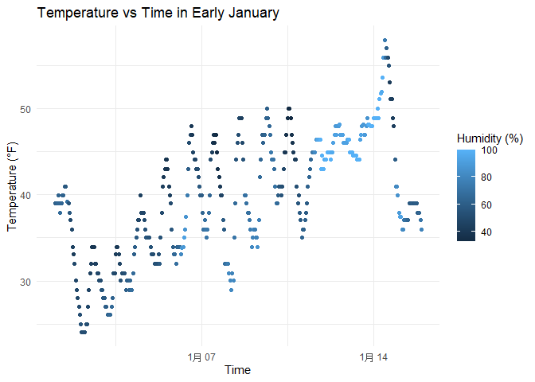

p8105_hw1_fx2212
================
Fenglin Xie
2025-09-15

# Problem 1

## The introduction of the dataset

``` r
library(moderndive)
data("early_january_weather")
```

This dataset has 15 variables and 358 observations, including varibles
as follows:origin, year, month, day, hour, temp, dewp, humid, wind_dir,
wind_speed, wind_gust, precip, pressure, visib, time_hour. Besides, the
mean temperature is 39.5821229.

## Make a scatterplot and the descriptions for the plot

``` r
library(tidyverse)
```

    ## ── Attaching core tidyverse packages ──────────────────────── tidyverse 2.0.0 ──
    ## ✔ dplyr     1.1.4     ✔ readr     2.1.5
    ## ✔ forcats   1.0.0     ✔ stringr   1.5.1
    ## ✔ ggplot2   3.5.2     ✔ tibble    3.3.0
    ## ✔ lubridate 1.9.4     ✔ tidyr     1.3.1
    ## ✔ purrr     1.1.0     
    ## ── Conflicts ────────────────────────────────────────── tidyverse_conflicts() ──
    ## ✖ dplyr::filter() masks stats::filter()
    ## ✖ dplyr::lag()    masks stats::lag()
    ## ℹ Use the conflicted package (<http://conflicted.r-lib.org/>) to force all conflicts to become errors

``` r
temp_vs_time_plot <- ggplot(early_january_weather, 
                            aes(x = time_hour, y = temp, color = humid)) +
  geom_point() +
  labs(title = "Temperature vs Time in Early January",
       x = "Time",
       y = "Temperature (°F)",
       color = "Humidity (%)") +
  theme_minimal()

print(temp_vs_time_plot)
```

<!-- -->

From this plot, we can see the two points: + Humidity levels show a
relationship with temperature patterns, with higher humidity values
often coinciding with periods of elevated temperature. + There appears
to be a slight overall increase in temperature values from January 7 to
January 14

## Export the scatterplot to project directory

``` r
ggsave("temp_vs_time_plot.png")
```

    ## Saving 7 x 5 in image

# Problem 2

## Create a data frame

``` r
set.seed(123)

df <- tibble(
  norm_samp = rnorm(10, 0, 1),
  log_vec = norm_samp > 0,
  char_vec = letters[1:10],
  fact_vec = factor(rep(c("low", "medium", "high"), length.out = 10))
)

print(df)
```

    ## # A tibble: 10 × 4
    ##    norm_samp log_vec char_vec fact_vec
    ##        <dbl> <lgl>   <chr>    <fct>   
    ##  1   -0.560  FALSE   a        low     
    ##  2   -0.230  FALSE   b        medium  
    ##  3    1.56   TRUE    c        high    
    ##  4    0.0705 TRUE    d        low     
    ##  5    0.129  TRUE    e        medium  
    ##  6    1.72   TRUE    f        high    
    ##  7    0.461  TRUE    g        low     
    ##  8   -1.27   FALSE   h        medium  
    ##  9   -0.687  FALSE   i        high    
    ## 10   -0.446  FALSE   j        low

## Calculate means for each variable

``` r
mean_norm <- mean(pull(df, norm_samp))
mean_logical <- mean(pull(df, log_vec))
mean_character <- mean(pull(df, char_vec))
```

    ## Warning in mean.default(pull(df, char_vec)): argument is not numeric or
    ## logical: returning NA

``` r
mean_factor <- mean(pull(df, fact_vec))
```

    ## Warning in mean.default(pull(df, fact_vec)): argument is not numeric or
    ## logical: returning NA

Only the numeric variable (norm_samp) and logical variable (log_vec) can
be used to calculate a mean. The character variable (char_vec) and
factor variable (fact_vec) cannot be used to calculate a mean, as
attempting to do so would result in an error.

## Apply as.numeric to different variable types

``` r
logical_to_numeric <- as.numeric(pull(df, log_vec))
character_to_numeric <- as.numeric(pull(df, char_vec))
```

    ## Warning: NAs introduced by coercion

``` r
factor_to_numeric <- as.numeric(pull(df, fact_vec))

logical_to_numeric 
```

    ##  [1] 0 0 1 1 1 1 1 0 0 0

``` r
character_to_numeric
```

    ##  [1] NA NA NA NA NA NA NA NA NA NA

``` r
factor_to_numeric
```

    ##  [1] 2 3 1 2 3 1 2 3 1 2

When we apply as.numeric() to different variable types:

- The logical vector converts successfully: TRUE becomes 1 and FALSE
  becomes 0
- The character vector fails to convert meaningfully, resulting in NA
  values for all elements
- The factor vector converts to the underlying integer codes
  representing the factor levels

This helps explain why we can calculate the mean of the logical vector
(as it gets implicitly converted to 1s and 0s) but not the character or
factor vectors. R can only calculate means for numeric data or data that
can be meaningfully converted to numeric values.
